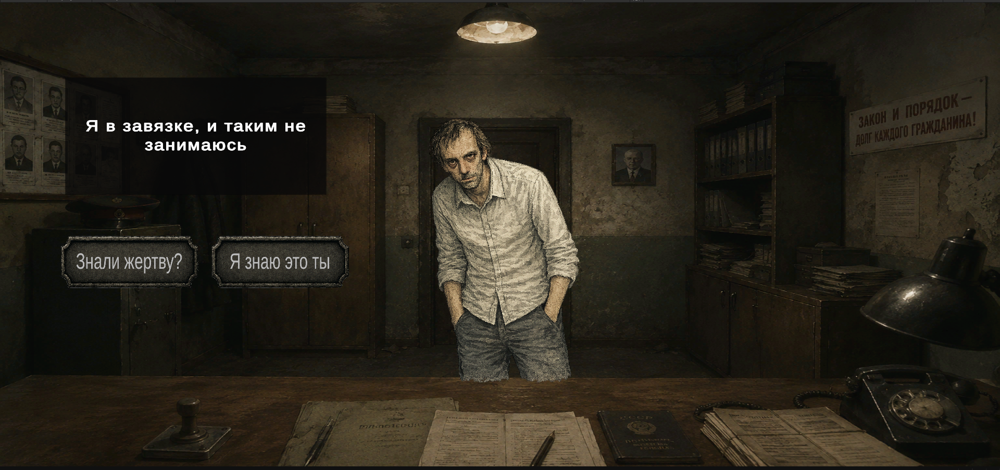
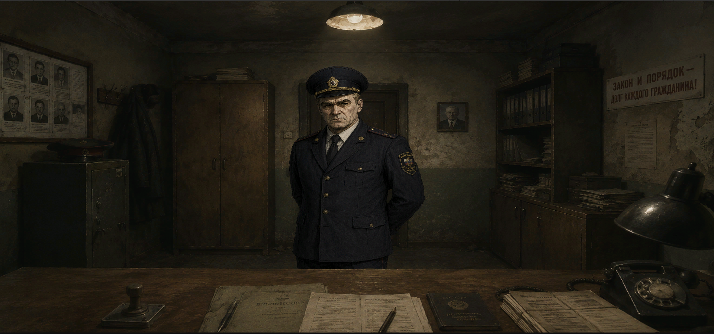

# Investigator-2000

# Название проекта

Краткое описание проекта.

## 🎮 Возможности

- Новая Input System
- Dependency Injection (Zenject)
- Чистая архитектура
- Анимации UI
- Система диалогов

## Скриншоты

## 🛠️ Используемые технологии
- UniTask
- TextMeshPro

## 🚀 Запуск проекта

1. Клонировать репозиторий
2. Открыть проект в Unity
3. Открыть сцену `Assets/Scenes/Main.unity`
4. Нажать Play

## 📂 Структура проекта
MVP

## 📄 Архитектура

Проект разделен на:
- Core
- Services
- UI
- Gameplay

